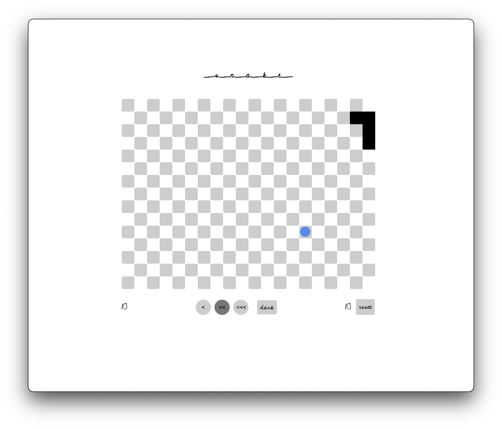
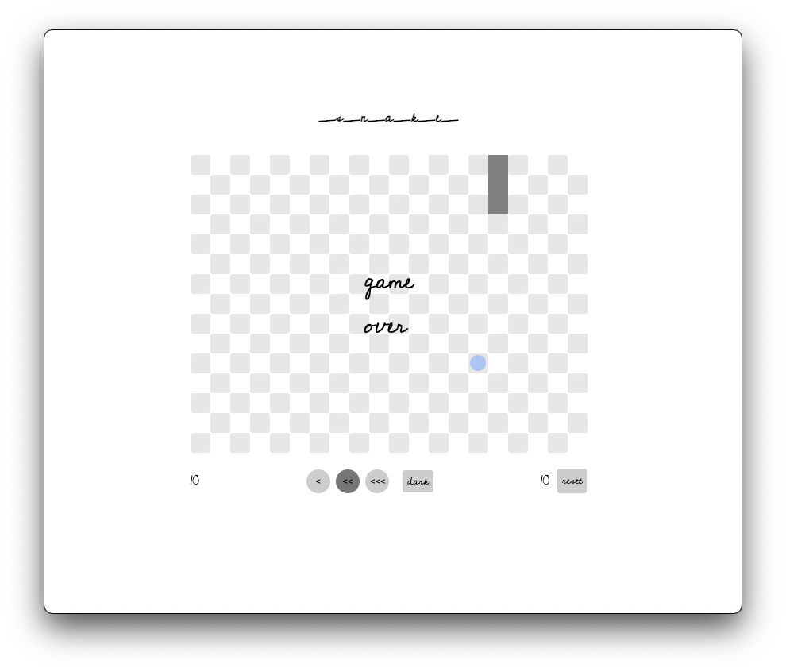
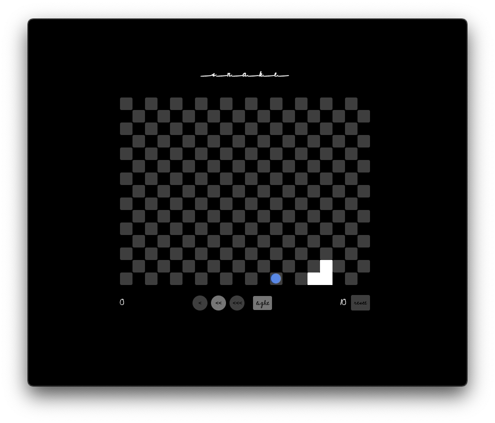

# _s_n_a_k_e_

## Date: 8/3/2022

### Author: Amaya Lucas

#### [_s_n_a_k_e_](https://_s_n_a_k_e_.surge.sh/) || [GitHub](https://github.com/ajluc) | [LinkedIn](https://www.linkedin.com/in/amaya-lucas/) | [Instagram](https://instagram.com/ayama.jo)

---

### **_Description_**

This project is a recreation of the classic browser game Snake, using vanilla Javascript. The introduction of time and motion to JS provides an interesting challenge when building a game like Snake.

---

### **_Technologies Used_**

1. Vanilla Javascript
2. DOM Manipulation
3. Classes and Instances/Inheritance
4. HTML
5. CSS

---

### **_Getting Started_**

Hit the arrow keys and start playing! A countdown fires before gameplay. On game over, clicking the board or hitting spacebar allows the user to play again. The current round's score is stored at the bottom left, and high score is stored at the bottom right. In the center are buttons to control the speed/difficulty of the game and a toggle for light or dark mode.

---

### **_Screenshots_**

Light mode of gameplay:

Game over screen:

Dark mode of gameplay:

---

### **_Tasks_**

- [x] Difficulty levels that change the snake's speed
- [x] Countdown timer before gameplay
- [x] Make targets a circle pushed on top of grid, rather than altering grid style
- [ ] Add secondary target with larger score weight. Can it generate only in the outer few rows/columns?
- [ ] Add sounds for game over and countdown

---

### **_Credits_**

Disable Scrolling: [stackoverflow.com](https://stackoverflow.com/questions/8916620/disable-arrow-key-scrolling-in-users-browser)

setInterval: [w3schools.com](https://www.w3schools.com/jsref/met_win_setinterval.asp)

Git Branching: [git-scm.com](https://git-scm.com/book/en/v2/Git-Branching-Basic-Branching-and-Merging)

Replacing CSS File: [stackoverflow.com](https://stackoverflow.com/questions/19844545/replacing-css-file-on-the-fly-and-apply-the-new-style-to-the-page)

Adding Sound: [Noah Eakin on Medium](https://noaheakin.medium.com/adding-sound-to-your-js-web-app-f6a0ca728984#:~:text=The%20simplest%20way%20to%20add,starts%20playing%20the%20current%20audio.)

Markdown Guide: [ia.net](https://ia.net/writer/support/general/markdown-guide)
